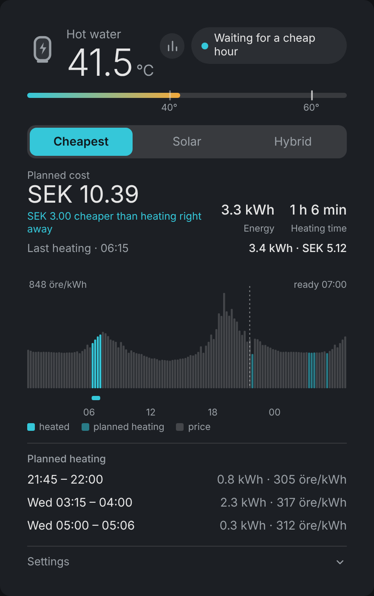
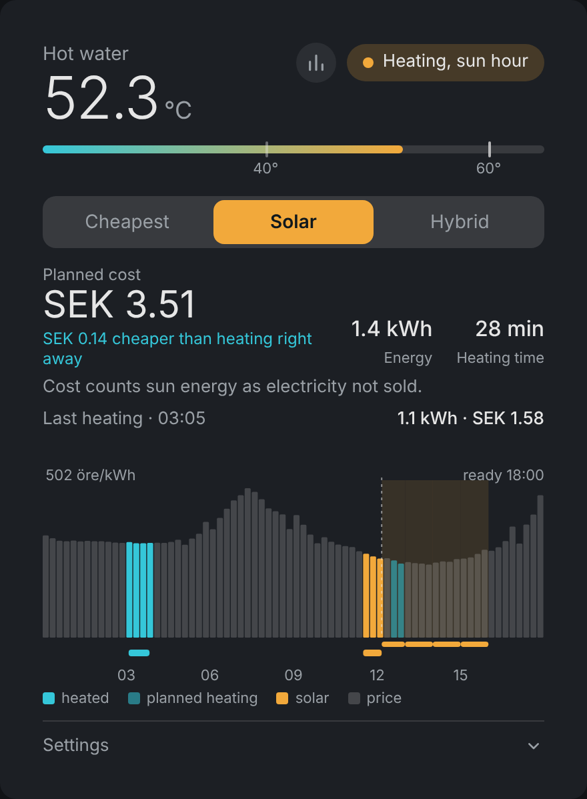
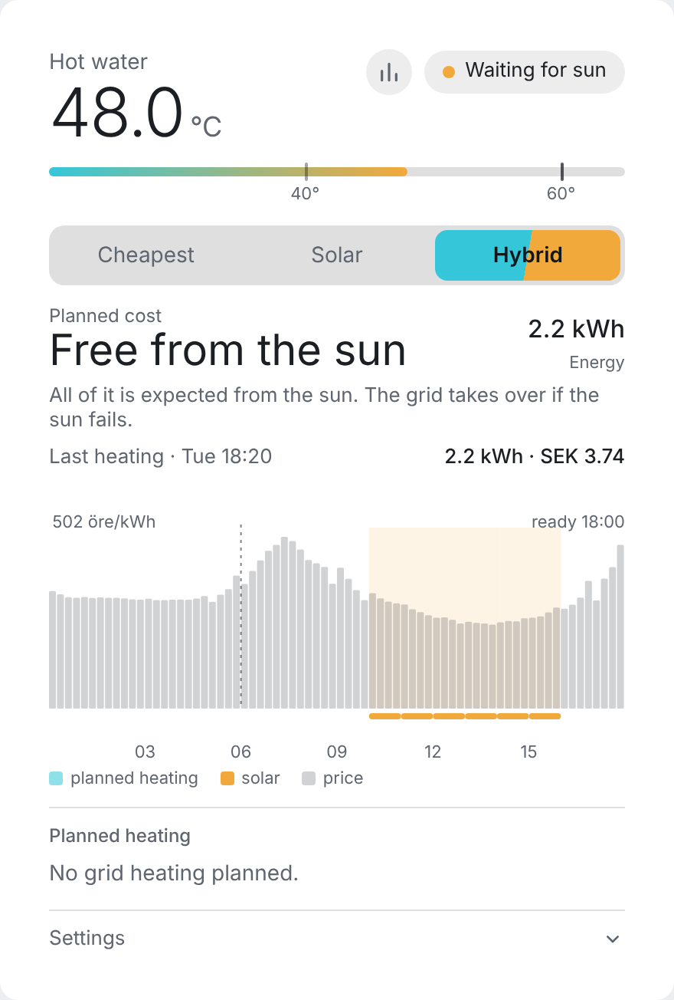
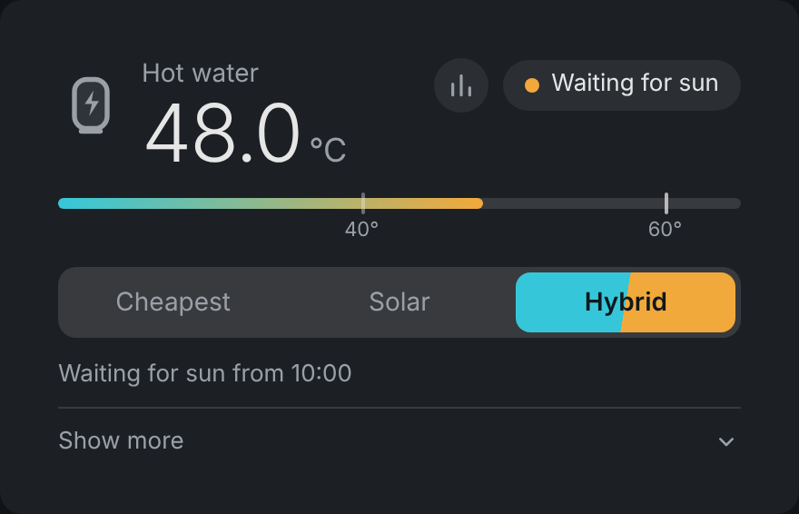
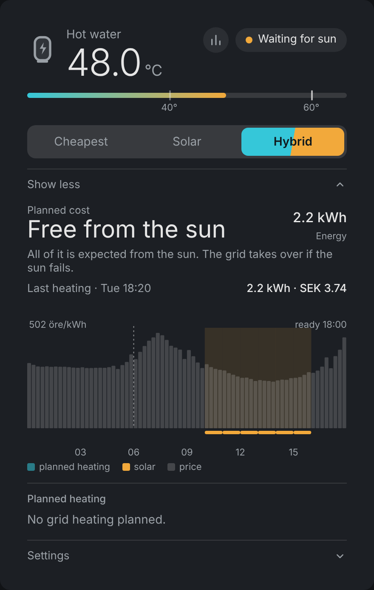
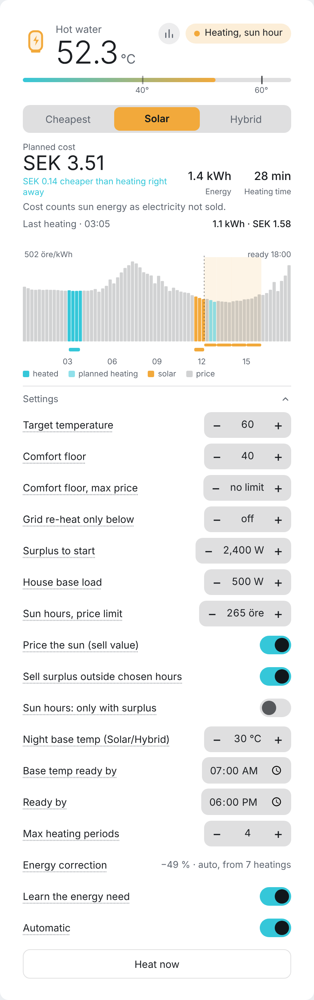
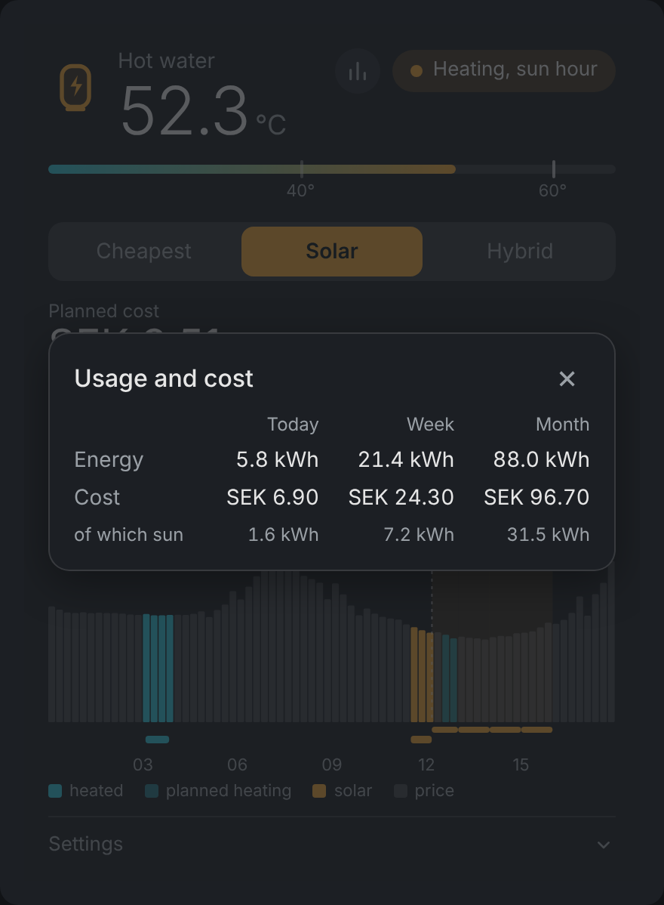

# Water Heater Planner

[](https://github.com/patrikron/waterheater-planner-home-assistant/actions/workflows/tests.yml)
[](https://github.com/patrikron/waterheater-planner-home-assistant/actions/workflows/validate.yml)
[](https://hacs.xyz)

*Svenska: [README.sv.md](README.sv.md)*

A Home Assistant integration that heats a **hot water tank** when electricity is cheap, when the sun
shines, or a mix of both. It works with any water heater that is controlled by a plain on/off switch.

<p align="center"></p>

> The screenshots show sample data: a real price day, a made-up sunny forecast and a made-up 300 L tank,
> run through the real planner.

## Contents

- [Features](#features)
- [Installation](#installation)
- [Setup](#setup) (every option in the setup dialog)
- [Modes](#modes)
- [The card](#the-card) and [every setting](#settings-reference)
- [Entities](#entities)
- [How it works](#how-it-works)
- [Troubleshooting](#troubleshooting)
- [Limitations](#limitations) and [Development](#development)

## Features

- **Three modes:** *Cheapest* (the exact cheapest quarters before your deadline), *Solar* (surplus power only)
  and *Hybrid* (cheap grid power, but waits for the sun when the forecast is good enough).
- **Uses the sensors you already have:** any price sensor, a grid power sensor for solar surplus, and the
  solar forecast integrations behind the Energy dashboard. No cloud service, no API key.
- **Closed loop:** the plan is only a schedule. Heating always stops when the measured water temperature
  reaches the target, so a wrong volume or power makes the plan less exact, never the result wrong.
- **Learns the energy need** from your real heatings, which matters when the temperature sensor sits on
  the outside of the tank.
- **Comfort floor** with an optional price cap, a **base temperature** for solar and hybrid mode, a **price limit
  for sun hours**, a "Heat now" boost, and a plain thermostat fallback when prices are missing.
- **A card** with the plan, the cost, a price chart that shows when the heater really ran, the last
  heating's energy and cost, and all settings.

## Installation

### HACS (recommended)

[](https://my.home-assistant.io/redirect/hacs_repository/?owner=patrikron&repository=waterheater-planner-home-assistant&category=integration)

Or by hand:

1. Open **HACS** in Home Assistant, click the menu (⋮, top right) → **Custom repositories**.
2. Paste `https://github.com/patrikron/waterheater-planner-home-assistant`, choose the category
   **Integration** and click **Add**.
3. Search for **Water Heater Planner** in HACS, open it and click **Download** (pick the latest version).
4. Restart Home Assistant.

HACS then shows new versions as updates. Download the update and restart Home Assistant. Your settings are
kept. If you installed by copying files before, delete the old `custom_components/waterheater_planner`
folder first, but do **not** remove the integration under Devices & services (that would delete its settings).

### Manually

1. Copy `custom_components/waterheater_planner` to `config/custom_components/`.
2. Restart Home Assistant.

Then go to **Settings → Devices & services → Add integration → Water Heater Planner**.

Python code is only loaded when Home Assistant starts, so after an update you must restart (a quick
restart is enough). A change in the card file only needs a hard refresh of the browser.

## Setup

The setup has three steps. The same three steps are available later under **Configure** on the integration
(changing them reloads the integration).

### Step 1: the heater

| Option | Required | What it is |
|---|---|---|
| **Name** | yes (setup only) | Name of the device, e.g. *Hot water*. |
| **Price sensor** | yes | The sensor that gives the electricity price. It must have a price list as an attribute: `raw_today`/`raw_tomorrow` (Nord Pool, Energi Data Service), `prices` or `prices_today`/`prices_tomorrow` (ENTSO-e), or `today`/`tomorrow`. Hourly, half-hourly and quarter-hourly prices work. Currency and unit (SEK/kWh, öre/kWh, c/kWh, EUR/MWh, ...) are read from the sensor. |
| **Switch (on/off)** | yes | The `switch` or `input_boolean` that turns the heater on and off. |
| **Temperature sensor (water)** | yes | A sensor (or `input_number`) with the water temperature in °C. |
| **Power** | yes | The heater's power in W when the element is on. Default 3000. |
| **Tank volume** | yes | Litres. Default 200. |
| **Energy today / this week / this month** | no | The heater's own energy counters (kWh). Used in the usage popup. |
| **Heater power sensor** | no | Measures the heater's real power. Makes the learning of the energy need exact and gives the *Energy, last heating* sensor exact values. Without it, full power is assumed while the switch is on. |

### Step 2: solar (optional)

Needed for *Solar* and *Hybrid* mode. Skip it if you only want *Cheapest*.

| Option | What it is |
|---|---|
| **Grid power (W)** | A sensor for the house's total grid power. **Positive = importing from the grid, negative = exporting.** This is how surplus is detected; it must be measured at the main fuse and include the heater. |
| **Grid power: positive = export** | Tick this if your sensor has the opposite sign. |
| **House battery power (W)** | Optional. Positive = charging. Battery charging then counts as surplus that can be used. |
| **Battery: positive = discharging** | Tick this if your battery sensor has the opposite sign. |
| **Solar forecast sources** | The integrations that provide a solar forecast for the Energy dashboard (Forecast.Solar, Solcast, Open-Meteo, ...). Used to pick sun hours in *Hybrid* mode and in *Solar* mode with a price limit. |
| **House base load** | What the house draws anyway (W). Taken off the forecast. Default 500. Can also be changed on the card. |
| **Surplus needed to start** | Surplus (W) before the heater starts on solar. Default is 80 % of the heater's power. Can also be changed on the card. |

### Step 3: electricity price add-ons (optional)

Only fill this in if the price sensor shows the **bare spot price**. If the sensor already includes tax,
grid fee and VAT, leave the fields empty.

| Option | What it is |
|---|---|
| **Energy tax** | Per kWh, in the sensor's minor unit (e.g. öre). |
| **Grid fee** | Per kWh, in the sensor's minor unit. |
| **VAT** | Percent. The price used is `(spot + tax + grid fee) × (1 + VAT)`. |

## Modes

| Mode | What it does |
|---|---|
| **Cheapest** | Works out which quarters before *Ready by* give the lowest cost and heats then. The plan is exact, not greedy: with few allowed heating periods, a slightly dearer hour that joins two cheap ones can win. |
| **Solar** | Buys no grid power. Heats only when the solar surplus is enough, with start and stop delays so that a passing cloud does not make the element chatter. Optional extras: a [base temperature](#base-temperature-solar-and-hybrid-mode) and a [price limit for sun hours](#price-limit-for-sun-hours-solar-mode). |
| **Hybrid** | Cheapest planning that may hold back energy in the hope of sun. If the forecast is enough on its own it waits for the sun, if it is partly enough the rest is heated at night, and if the sun fails the grid takes over in time. |

Hybrid never holds back more than it can still buy before the deadline (hoping for sun can make heating
dearer but never late), and only when the expected gain is worth the risk. The forecast is trusted at
50 %, because public forecasts tend to be optimistic.

<p align="center">
  
  
</p>

## The card

The integration serves the card itself, so no dashboard resource has to be added. Add the card
**Water Heater Planner** to a dashboard, or use YAML:

```yaml
type: custom:waterheater-planner-card
entity: sensor.hot_water_status      # the integration's Status sensor
name: Hot water                      # optional
settings: collapsed                  # collapsed (default) | open | hidden
view: full                           # full (default) | compact
icon: large                          # large (default) | small | none
icon_name: mdi:water-boiler          # optional: any Home Assistant icon instead of the built-in tank
secondary_text: theme                # grey texts: theme (default) | bright | primary
```

**Grey texts** (`secondary_text`) are hard to read in some dark themes. `theme` uses the theme's secondary text colour,
`bright` a lighter mix of the main text colour, and `primary` the same colour as the main text (white in a dark theme).
The choice is also in the card editor under *Grey texts*.

**Compact view** (`view: compact`) shows only the temperature, the status, the usage button and the mode buttons, plus one line saying when the next heating is planned.
A **Show more** button folds out the rest (cost, chart, planned heating and settings). `full` shows everything, as before.

<p align="center">
  
  
</p>

If the card does not show up in the picker, do a hard refresh (Ctrl+Shift+R, or clear the app cache).

What the card shows, from the top:

- **Temperature** with a gauge for the comfort floor and the target. Click the temperature to open the temperature sensor.
- **Status** (chip) says *why* the heater does what it does; it glows while the switch is really on. Click it to open the switch's more-info dialog. The **bar-chart button** next to it opens the usage popup.
- **Mode buttons.**
- **Planned cost**, energy and heating time, plus how much cheaper the plan is than heating right away.
- **Last heating:** energy and cost of the latest heating (or the one running now).
- **Chart:** the price per quarter from 00:00 today, planned heating, forecast sun hours and, as a strip
  under the chart, the times the heater really ran (turquoise = grid, yellow = sun). Hover or touch a bar for the price; on a bar where the heater ran it also shows how long, how much energy and why (planned cheap power, solar surplus, chosen sun hour, base temperature, comfort floor or Heat now).
- **Planned heating:** the planned periods with energy and price.
- **Settings**, which are listed below. Hover a setting for an explanation (a tooltip); on a touch screen, tap its label to show the text under the row.

### Settings reference

All settings live on the card (under **Settings**) and as entities, so you can use them in automations
and dashboards. Values are stored and survive restarts.

<p align="center"></p>

| Setting | Entity | Default | Range | What it does |
|---|---|---|---|---|
| **Mode** | `select` Mode | Hybrid if a solar forecast is configured, else Cheapest | Cheapest / Solar / Hybrid | See [Modes](#modes). |
| **Target temperature** | `number` Target temperature | 60 °C | 30–85 | Heating stops when the measured water temperature reaches this, whatever the plan says. |
| **Comfort floor** | `number` Comfort floor | 40 °C | 0–70 (0 = off) | Below this the water is heated immediately, whatever the price. Turns off again 1 °C above. |
| **Wait only if it saves** | `number` Wait for a cheaper hour only if it saves | 0 (off) | 0–200 öre/kWh | Hybrid: with sun to spare, start now unless a later hour is at least this much cheaper per kWh. See [below](#wait-only-if-it-saves). |
| **Grid re-heat only below** | `number` Grid re-heat below | 0 (off) | 0–85 °C | A guard against re-heating from the grid after a heating has reached the target. See [below](#grid-re-heat-limit). |
| **Comfort floor, max price** | `number` Comfort floor max price | 0 (no limit) | 0–1000 öre/kWh | The comfort floor does not heat while the price is above this. The normal plan (cheap hours, sun) and *Heat now* still work. Shown when the comfort floor is on. |
| **Ready by** | `time` Ready by | 16:00 | any time | The time the water should be hot. The planner picks hours before the next occurrence of this time. |
| **Max heating periods** | `number` Max heating periods | 4 | 1–8 | How many separate heating periods the plan may use. Fewer = fewer relay switches, a bit dearer. |
| **Energy correction** | `number` Energy correction | 0 % | −50…+100 | Corrects the calculated energy need. Use a negative value if the estimate is too high, positive if too low. Ignored while *Learn the energy need* is on and has an answer. |
| **Learn the energy need** | `switch` Learn energy need | on | on / off | The correction is learned from real heatings (see [Learning](#learning-the-energy-need)). Off = the manual correction is used. |
| **Automatic** | `switch` Automatic | on | on / off | Off = the planner leaves the heater switch completely alone. |
| **Heat now** | `switch` Heat now | off | on / off | Heat to the target now, whatever the price. Switches itself off when the target is reached. |

Settings that only apply to **Solar** and **Hybrid** (the first two and the base temperature rows show in both, the rest only in Solar):

| Setting | Entity | Default | Range | What it does |
|---|---|---|---|---|
| **Surplus to start** | `number` Surplus to start | 80 % of the heater power | 50–10000 W | Surplus needed before the heater starts on solar. The heater stops when the surplus has been below the *stop limit* for 5 minutes. The stop limit is the lower of this value and half the heater's power. |
| **House base load** | `number` House base load | 500 W | 0–10000 W | What the house draws anyway. Taken off the solar forecast when sun hours are chosen: an hour counts as a sun hour only if the forecast minus the base load reaches *Surplus to start*. Does not affect the live start and stop, which use the grid sensor. |
| **Sun hours, price limit** | `number` Solar mode: price limit | 0 (off) | 0–1000 öre/kWh | See [below](#price-limit-for-sun-hours-solar-mode). |
| **Sell surplus outside the chosen hours** | `switch` Solar mode: sell surplus outside the chosen sun hours | on | on / off | Off: surplus is used in every hour. Shown in Solar mode when the price limit is set. |
| **Sun hours: only with surplus** | `switch` Solar mode: heat in sun hours only when the surplus is enough | off | on / off | The chosen sun hours heat only on real surplus; the grid never fills in. Shown in Solar mode when the price limit is set. |
| **Price the sun (sell value)** | `switch` Solar mode: price the sun as unsold electricity | on | on / off | Only the cost calculation. See [below](#price-limit-for-sun-hours-solar-mode). Shown when the price limit is above 0. |
| **Night base temp (Solar/Hybrid)** | `number` Base temperature (solar mode) | 0 (off) | 0–60 °C | Shown in every mode; used in Solar and Hybrid mode. See [below](#base-temperature-solar-and-hybrid-mode). |
| **Base temp ready by** | `time` Base temperature ready by | 07:00 | any time | When the base temperature should be reached. Shown when a base temperature is set. |

Changes in **Surplus to start** and **House base load** made on the card win over the values in the
integration's configuration, until you change the configuration again.

### Base temperature (Solar and Hybrid mode)

In Solar mode the heater only uses surplus power. If you still want a floor for the morning, set a
**base temperature**. The planner then buys exactly the energy needed to reach the base temperature
from the grid, in the cheapest hours before **Base temp ready by**, and stops there. The sun does
the rest.

Example: base temperature 25 °C, water at 10 °C → it heats to 25 °C during the night and then waits
for the sun. A new heating starts only when the water is at least 2 K below the base temperature.
In **Hybrid** mode the base temperature is bought first, in the cheapest hours before **Base temp ready
by**. Hybrid then plans the rest of the need as usual (sun or cheap grid). So even if the forecast alone
could cover the heating, the water is warmed up to the base temperature during the night. In **Cheapest**
mode the setting has no effect.

### Price limit for sun hours (solar mode)

Normally Solar mode heats only when there is surplus right now. With a **price limit** (öre/kWh,
0 = off) the planner picks among the hours where the solar forecast is enough:

- Sun hours **at or below the limit** are open the whole time: the heater may be on, so there is hot water the
  moment it is used.
- If they cannot carry the whole need, the **cheapest dearer sun hours** are added, as few as possible.
- Hours without enough forecast are never used by this feature.
- Requires a solar forecast. Without one, Solar mode behaves as before. The comfort floor and *Heat now* work as usual.

**Price the sun** only decides how the **cost** is counted:

- **On (default):** the sun is **not free**. Every kWh it gives the heater is a kWh that could have been
  sold, so the plan's cost is the hour's electricity price.
- **Off:** the sun is free. The cost shown is only the share the grid is assumed to supply (the forecast is
  trusted at 50 %).

It does not change what the heater does. That is decided by the next two switches.

**Sell surplus outside the chosen hours** decides what happens in sun hours the planner did **not** choose:

- **On (default):** the heater does not use surplus there. It is sold. Solar mode then heats only in the
  chosen hours, which are the cheapest sun hours (all below the price limit, plus as few dearer ones as the
  need requires).
- **Off:** surplus is used in every hour, also those the planner did not choose.

**Sun hours: only with surplus** decides what the chosen sun hours do when the sun is not enough:

- **Off (default):** the chosen hours are open the whole time. The heater runs whatever the surplus is, and
  the grid fills in what the sun cannot give (that is why the cost is not zero).
- **On:** the planner only chooses *which* hours are allowed. Inside them the heater still needs the real
  surplus (*Surplus to start*, with the usual start and stop delays) and switches off when it falls away.
  Nothing is bought from the grid, so the plan's cost is 0 when the sun is free (*Price the sun* off). On a
  cloudy day the water may not reach the target.

### Learning the energy need

The textbook formula `litres × 4.186 × temperature rise` only holds if the sensor measures the water's
mean temperature. A sensor on the outside of the tank, or low in it, can be far off (for a 300 L tank
by half). The planner therefore follows every finished heating: how much energy it took and how the
sensor reading changed from start to target. After three clean heatings it works out the correction
itself and uses it, and it keeps refining it over the last twenty. Heatings where hot water was drawn,
that are too small, or that did not reach the target do not count.

- Until three heatings are done, the manual correction is used, so set a starting value.
- Point to a **heater power sensor** (optional) if you have one: then the energy is measured exactly.
- The diagnostic sensor *Energy correction* shows the value in use, and the card shows where it comes from.

### Wait only if it saves

The planner normally picks the very cheapest hours, even if that means waiting for a price that is only a few öre
lower than now. **Wait only if it saves** (öre/kWh, 0 = off) sets how much cheaper waiting has to be before the
heater holds back **when there is sun to spare**.

- The plan itself does not change: it still shows the cheapest hours.
- If the plan starts later, but heating from now without a break would cost less than the setting more per kWh,
  the heater **starts now as soon as there is some solar surplus**: **Early start at surplus** (default 25 % of the
  heater's power) to start and **Keep going until surplus below** (default 12 %) to keep going. The status says *Heating (solar)*.
- Without surplus, it waits for the planned hour as usual. A later hour that is clearly cheaper (more than the
  setting) is still waited for.

Example: with 10, a later hour that is 3 öre cheaper does not hold the heater back while the sun is shining, but one
that is 40 öre cheaper does. Hybrid mode only.

### Grid re-heat limit

**Grid re-heat only below** stops the planner from forcing in new grid heating after a shower, once the
water has already been heated up for the day.

1. The limit is **off** until a heating (cheap grid hours or sun) has **reached the target temperature**.
   Until then the planner works as usual and plans heating when the water is below the target.
2. From then on until the next **Ready by** time, nothing new is planned from the grid while the water is at
   or above the limit. A shower at 15:00 with *Ready by* 18:00 does not trigger heating, but free solar
   surplus may still heat. If the water falls **below** the limit, the planner heats it to the target again
   in the cheapest hours.
3. When **Ready by** has passed, the limit is reset and the planner plans the next heating (before the next
   *Ready by*) as usual. It does not apply again until a heating has reached the target.

A heating that began before a *Ready by* that has passed since (it ran a little late, e.g. started 17:30 and finished
18:02 with *Ready by* 18:00) belongs to that *Ready by* and does not guard the evening and night after it.

Set it to 0 to turn the limit off. The status sensor's `regrid_armed` attribute tells whether it holds right now.

### Last heating

The sensors **Energy, last heating** (kWh) and **Cost, last heating** show what the latest heating used
and cost. A heating is everything without a pause longer than 10 minutes. While it runs, the figures are
what has been used so far. Cost is the energy times the all-in price of each quarter (with your add-ons);
energy heated by solar surplus counts as free. The sensors have attributes for start, end, solar energy
and whether every quarter had a price. History starts when the integration is installed.

### Usage popup

The bar-chart button next to the status opens a popup with **energy and cost today, this week (from Monday)
and this month**, and how much of it was sun. The same figures are in the status sensor's `usage` attribute.

- **Energy** comes from the three optional sensors *Energy today / this week / this month* (kWh, e.g. your
  Shelly's daily, weekly and monthly sensors) if you set them in the integration's options. Without them
  the card shows what the integration has measured itself (the popup says so).
- **Cost** is always the integration's own: the energy of each quarter times that quarter's all-in price,
  with solar energy counted as free. It is kept per day for about 70 days and starts when the integration
  records it, so the first week and month are partial (the popup says since when).
- The sensors **Cost today**, **Cost this week** and **Cost this month** carry the same cost figures.

<p align="center"></p>

## Entities

Everything is grouped under one device. Names are translated (English and Swedish).

| Platform | Entity | Notes |
|---|---|---|
| `sensor` | **Status** | State = what the heater is doing (see below). Attributes contain the whole plan and everything the card draws. |
| `sensor` | Planned cost | Cost of the planned grid energy, in the price sensor's currency. |
| `sensor` | Energy needed | kWh to reach the target. |
| `sensor` | Planned heating time | A duration. Attributes `formatted` and `minutes`. |
| `sensor` | Next start | Timestamp of the next planned start. |
| `sensor` | Current price | All-in price now, in the minor unit per kWh. |
| `sensor` | Solar surplus | W, only when a grid sensor is set. |
| `sensor` | Energy, last heating / Cost, last heating, Cost today / this week / this month | See above. |
| `sensor` | Energy correction | Diagnostic: the correction in use. |
| `select` | Mode | |
| `number` | Target temperature, Comfort floor, Comfort floor max price, Grid re-heat below, Max heating periods, Energy correction, Surplus to start, House base load, Solar mode: price limit, Base temperature (solar mode) | See the settings table. |
| `time` | Ready by, Base temperature ready by | |
| `switch` | Automatic, Heat now, Learn energy need, Solar mode: price the sun as unsold electricity, Solar mode: sell surplus outside the chosen sun hours, Solar mode: heat in sun hours only when the surplus is enough | |

### Status values

| Status | Meaning |
|---|---|
| Off (manual control) | *Automatic* is off. The planner does not touch the switch. |
| No temperature | No reading from the temperature sensor for more than 10 minutes. The heater is turned off. |
| Switch unavailable | The switch does not respond. |
| Target reached | The water is at the target. |
| Idle | Nothing to heat. |
| Waiting for a cheap hour / for sun | The need is open, the heater waits for its hour. |
| Heating (cheap power) | Heating in a planned cheap slot. |
| Heating (solar) | Heating on live solar surplus. |
| Heating (sun hour) | Heating in a sun hour chosen by the price limit. |
| Heating (base temperature) | Solar or Hybrid mode is heating to the base temperature. |
| Heating (comfort floor) | The water was below the comfort floor. |
| Heating now | *Heat now* is on. |
| Manual heating | The switch was turned on outside the planner (by hand or by another automation). The planner leaves it on until the target is reached or you turn it off (at most 6 hours). |
| Waiting (price above the comfort cap) | Below the comfort floor, but the price is over its cap. |
| No price data | The price sensor has no usable prices. The heater runs as a plain thermostat until they are back. |
| Grid sensor missing | Solar mode needs a grid power sensor. |

## How it works

Every 30 seconds the integration reads the temperature, the switch and the sensors, updates the plan if
anything relevant changed (the plan is rebuilt every quarter hour at least) and decides whether the
switch should be on.

- **Energy need:** `litres × 4.186 kJ/(kg·K) × temperature difference / 3600`, with the correction.
  The heating time is the energy divided by the power.
- **Planning:** an exact search (dynamic programming over 5-minute steps) for the cheapest set of
  periods that covers the need before *Ready by*, within the allowed number of periods. Tomorrow's prices
  are published in the afternoon. If the plan needs hours that have no price yet, it buys only what cannot
  wait and extends the plan when the prices arrive.
- **Solar surplus:** calculated from the energy balance, not from the export:
  `available = heater power now + charging battery − grid import`. The heater's own consumption is
  therefore not counted as surplus. Start needs the surplus for 2 minutes, stop needs it to be below the
  stop limit for 5 minutes.
- **Protections:** minimum 5 minutes on and off, a 2 °C hysteresis before a new heating cycle starts,
  and the heater is turned off if the temperature sensor is silent for more than 10 minutes. Heat losses
  are deliberately ignored in the plan because the loop is closed.

## Troubleshooting

- **The card is not in the picker / shows an error.** Hard refresh the browser. Check that the
  integration is set up and that you use `entity: sensor.<name>_status`.
- **"The sensor has no price list."** The price sensor must have `raw_today`/`raw_tomorrow`, `prices`,
  `prices_today`/`prices_tomorrow` or `today`/`tomorrow` as attributes. Look at the sensor under
  Developer tools → States.
- **Solar surplus has the wrong sign.** It should be positive when the house exports. Check the grid sensor:
  it must be positive when importing. If not, tick *Grid power: positive = export* under Configure.
- **Status says "No price data" for a while after a restart.** The sensor was not ready yet. The planner keeps
  the last known prices if the sensor is only briefly unavailable.
- **The estimate is far off.** Wait for the learning (three heatings) or set *Energy correction* by hand.
- **Nothing changes after an update.** Python code needs a restart of Home Assistant. Only the card
  file needs a browser refresh.

Debug logs: add `custom_components.waterheater_planner: debug` under `logger:` in `configuration.yaml`.

## Limitations

- Works only with a heater controlled by an on/off switch. No stepwise power control.
- Prices come from the sensor you chose. If it has no prices (or is unavailable for long), the heater runs
  as a plain thermostat until they are back.
- Hybrid relies on the forecast being reasonable. It treats the sun as free, which overvalues holding back
  energy if you have a house battery or are paid for exports (use *Solar* mode with a price limit and
  *Price the sun* for that).
- The parts that need Home Assistant (config flow, entities, the controller) are not covered by the automated tests.

## Development

```sh
pip install pytest
pytest
```

The planner is compared against an exhaustive search on random cases, and the engine runs against a
simulated tank with real electricity prices (cold start, water draws, heat losses, sun that fails). The
screenshots in `docs/images` are generated by `docs/tools/make_screenshots.py` from the real planner.

GitHub Actions run the tests, [hassfest](https://developers.home-assistant.io/blog/2020/04/16/hassfest/) and
the HACS validation on every push, and a release builds a zip of the integration (see
[.github/workflows](.github/workflows)). See [CHANGELOG.md](CHANGELOG.md) for what changed.

## About this project

This integration was written with the help of [Claude](https://claude.ai) (Anthropic), under my direction and
running in my own home. I use it daily; bug reports and pull requests are welcome.

## License

MIT. Parts are adapted from SpotNav, see [NOTICE.md](NOTICE.md).
