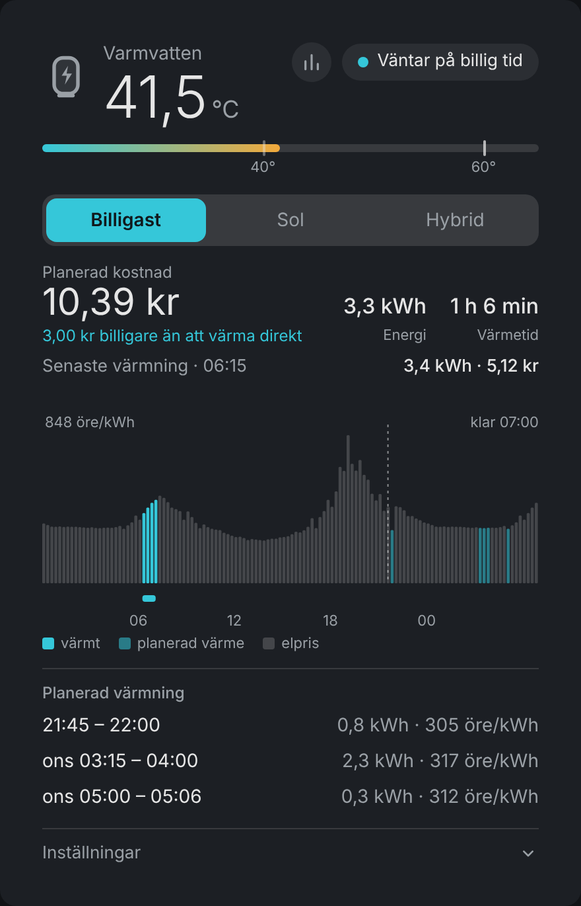
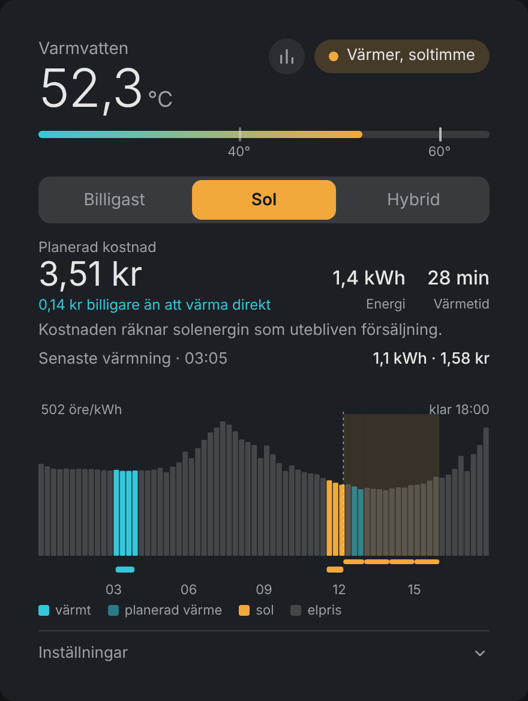
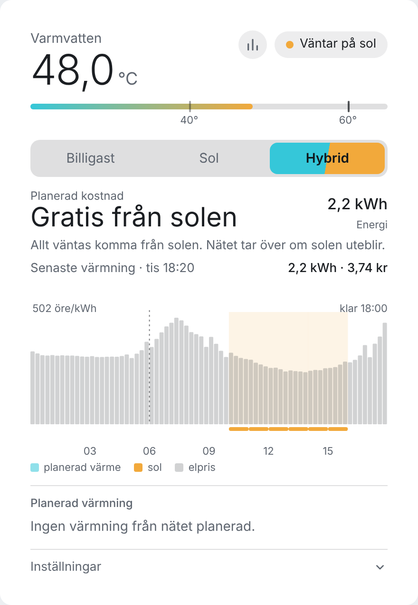
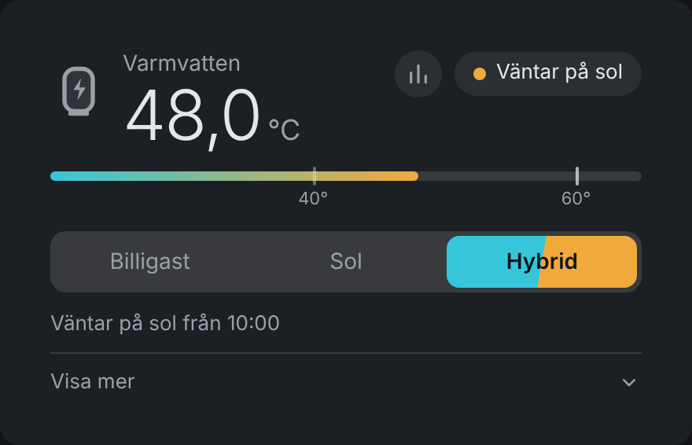
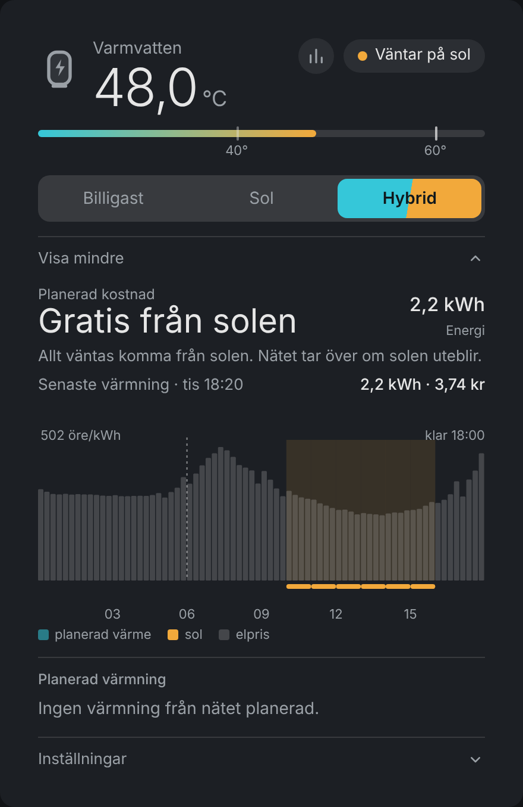
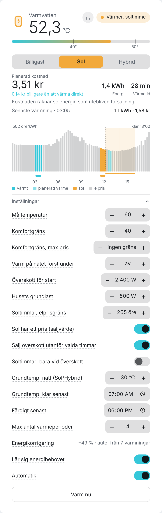
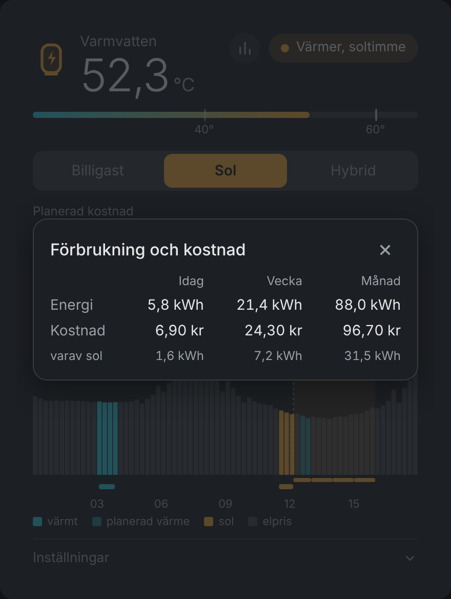

# Water Heater Planner

[](https://github.com/patrikron/waterheater-planner-home-assistant/actions/workflows/tests.yml)
[](https://github.com/patrikron/waterheater-planner-home-assistant/actions/workflows/validate.yml)
[](https://hacs.xyz)

*English: [README.md](README.md)*

En integration för Home Assistant som värmer **varmvattenberedaren** när elen är billig, när solen skiner,
eller en blandning. Den fungerar med varje beredare som styrs av en vanlig av/på-brytare.

<p align="center"></p>

> Skärmbilderna visar exempeldata: en riktig prisdag, en påhittad solig prognos och en påhittad
> 300-litersberedare, körda genom den riktiga planeraren.

## Innehåll

- [Funktioner](#funktioner)
- [Installation](#installation)
- [Inställning vid installation](#inställning-vid-installation) (alla val i dialogen)
- [Lägen](#lägen)
- [Kortet](#kortet) och [alla inställningar](#inställningar-i-kortet-och-som-entiteter)
- [Entiteter](#entiteter)
- [Så fungerar det](#så-fungerar-det)
- [Felsökning](#felsökning)
- [Begränsningar](#begränsningar) och [Utveckling](#utveckling)

## Funktioner

- **Tre lägen:** *Billigast* (de exakt billigaste kvartarna före din deadline), *Sol* (bara överskottsel)
  och *Hybrid* (billig nätel, men väntar på solen när prognosen är tillräckligt bra).
- **Använder sensorerna du redan har:** valfri prissensor, en nätsensor för solöverskott och
  solprognosintegrationerna bakom Energy-panelen. Ingen molntjänst och ingen nyckel.
- **Sluten reglering:** planen är bara ett schema. Värmningen stoppar alltid när den uppmätta
  vattentemperaturen når målet, så fel volym eller effekt gör planen mindre exakt men aldrig resultatet fel.
- **Lär sig energibehovet** från dina riktiga värmningar, vilket spelar roll när temperaturgivaren sitter
  på utsidan av tanken.
- **Komfortgräns** med valfritt pristak, **grundtemperatur** för Sol- och Hybrid-läge, **elprisgräns för soltimmar**,
  en "Värm nu"-knapp och vanlig termostatlogik som reserv när priser saknas.
- **Ett kort** med plan, kostnad, ett prisdiagram som visar när beredaren faktiskt värmt, energi och
  kostnad för senaste värmningen och alla inställningar.

## Installation

### HACS (rekommenderas)

[](https://my.home-assistant.io/redirect/hacs_repository/?owner=patrikron&repository=waterheater-planner-home-assistant&category=integration)

Eller för hand:

1. Öppna **HACS** i Home Assistant och klicka på menyn (⋮ uppe till höger) → **Anpassade arkiv**.
2. Klistra in `https://github.com/patrikron/waterheater-planner-home-assistant`, välj kategorin
   **Integration** och klicka på **Lägg till**.
3. Sök efter **Water Heater Planner** i HACS, öppna den och klicka på **Ladda ner** (välj senaste versionen).
4. Starta om Home Assistant.

HACS visar sedan nya versioner som uppdateringar. Ladda ner uppdateringen och starta om Home Assistant.
Dina inställningar behålls. Har du tidigare installerat genom att kopiera filer: ta bort den gamla mappen
`custom_components/waterheater_planner` först, men ta **inte** bort integrationen under Enheter & tjänster
(då försvinner inställningarna).

### Manuellt

1. Kopiera `custom_components/waterheater_planner` till `config/custom_components/`.
2. Starta om Home Assistant.

Gå sedan till **Inställningar → Enheter & tjänster → Lägg till integration → Water Heater Planner**.

Python-koden läses bara in när Home Assistant startar, så efter en uppdatering måste du starta om (en
snabbomstart räcker). Ändras bara kortfilen räcker en hård omladdning av webbläsaren.

## Inställning vid installation

Första frågan är **typ av installation**:

- **Enkel** frågar bara efter det viktigaste: beredaren (strömbrytare, temperatursensor, prissensor, effekt
  och volym) och, om du vill, nätsensor och solprognos. Kortet visar då bara måltemperatur, komfortgräns,
  färdigt senast, energikorrigering, lär energibehov, automatik och värm nu. Allt annat behåller sina
  standardvärden och fungerar som vanligt.
- **Avancerad** har alla val nedan och alla inställningar i kortet.

Du kan byta när som helst under **Konfigurera** på integrationen (ändringen laddar om integrationen). Värden
du har satt i avancerat läge finns kvar när du byter till enkel. Installationer från före det här valet är
fortsatt avancerade. Resten av installationen har upp till tre steg. Val som är markerade *(avancerat)*
visas bara i avancerat läge.

### Steg 1: beredaren

| Val | Krävs | Vad det är |
|---|---|---|
| **Namn** | ja (bara vid installation) | Enhetens namn, t.ex. *Varmvatten*. |
| **Prissensor** | ja | Sensorn som ger elpriset. Den måste ha en prislista som attribut: `raw_today`/`raw_tomorrow` (Nord Pool, Energi Data Service), `prices` eller `prices_today`/`prices_tomorrow` (ENTSO-e), eller `today`/`tomorrow`. Timpriser, halvtimmespriser och kvartspriser fungerar. Valuta och enhet (SEK/kWh, öre/kWh, c/kWh, EUR/MWh, ...) läses från sensorn. |
| **Strömbrytare (på/av)** | ja | `switch` eller `input_boolean` som slår på och av beredaren. |
| **Temperatursensor (vattnet)** | ja | En sensor (eller `input_number`) med vattentemperaturen i °C. |
| **Effekt** | ja | Beredarens effekt i W när elementet är på. Standard 3000. |
| **Tankens volym** | ja | Liter. Standard 200. |
| **Energi idag / denna vecka / denna månad** *(avancerat)* | nej | Beredarens egna energiräknare (kWh). Visas i förbrukningsrutan. |
| **Beredarens effektsensor** *(avancerat)* | nej | Mäter beredarens verkliga effekt. Gör inlärningen av energibehovet exakt och ger exakta värden i sensorn *Energi senaste värmning*. Utan den antas full effekt när strömbrytaren är på. |

### Steg 2: sol (valfritt)

Behövs för lägena *Sol* och *Hybrid*. Hoppa över om du bara vill köra *Billigast*.

| Val | Vad det är |
|---|---|
| **Elnätseffekt (W)** | En sensor för husets totala effekt mot elnätet. **Positivt = import från nätet, negativt = export.** Så upptäcks överskottet. Den ska mäta vid huvudsäkringen och inkludera beredaren. |
| **Elnätseffekt: positivt värde = export** | Bocka i om din sensor har omvänt tecken. |
| **Husbatteriets effekt (W)** *(avancerat)* | Valfri. Positivt = laddar. Batteriladdning räknas då som överskott som kan användas. |
| **Batteri: positivt värde = urladdning** *(avancerat)* | Bocka i om batterisensorn har omvänt tecken. |
| **Solprognoskällor** | Integrationerna som ger solprognos till Energy-panelen (Forecast.Solar, Solcast, Open-Meteo, ...). Används för att välja soltimmar i *Hybrid* och i *Sol* med elprisgräns. |
| **Husets grundlast** *(avancerat)* | Vad huset drar ändå (W). Dras av prognosen. Standard 500. Kan också ändras i kortet. |
| **Överskott för start** *(avancerat)* | Överskott (W) innan beredaren startar på sol. Standard är 80 % av beredarens effekt. Kan också ändras i kortet. |

### Steg 3: pristillägg (valfritt, avancerat)

Fyll bara i detta om prissensorn visar **rent spotpris**. Visar sensorn redan pris inklusive skatt,
nätavgift och moms, lämna fälten tomma.

| Val | Vad det är |
|---|---|
| **Energiskatt** | Per kWh, i sensorns mindre enhet (t.ex. öre). |
| **Nätavgift** | Per kWh, i sensorns mindre enhet. |
| **Moms** | Procent. Priset som används är `(spot + skatt + nätavgift) × (1 + moms)`. |

## Lägen

| Läge | Vad det gör |
|---|---|
| **Billigast** | Räknar ut vilka kvartar före *Färdigt senast* som ger lägst kostnad och värmer då. Planen är exakt, inte girig: med få tillåtna värmeperioder kan en något dyrare timme som binder ihop två billiga vinna. |
| **Sol** | Köper ingen el av nätet. Värmer bara när solöverskottet räcker, med start- och stoppfördröjning så att ett moln inte får elementet att slå av och på. Valfria tillägg: [grundtemperatur](#grundtemperatur-sol--och-hybrid-läge) och [elprisgräns för soltimmar](#elprisgräns-för-soltimmar-sol-läge). |
| **Hybrid** | Billigast-planering som får hålla inne energi i hopp om sol. Räcker prognosen helt väntar den på solen, räcker den delvis värms resten på natten, och uteblir solen tar nätet över i tid. |

Hybrid håller aldrig inne mer än vad den hinner köpa före deadline (att hoppas på sol kan göra det
dyrare men aldrig sent), och bara när den förväntade vinsten är värd risken. Prognosen räknas med 50 %
tillit eftersom publika prognoser brukar vara optimistiska.

<p align="center">
  
  
</p>

## Kortet

Integrationen serverar kortet själv, så ingen dashboard-resurs behöver läggas till. Lägg till kortet
**Water Heater Planner** på en dashboard, eller använd YAML:

```yaml
type: custom:waterheater-planner-card
entity: sensor.varmvatten_status     # integrationens Status-sensor
name: Varmvatten                     # valfritt
settings: collapsed                  # collapsed (standard) | open | hidden
view: full                           # full (standard) | compact
icon: large                          # large (standard) | small | none
icon_name: mdi:water-boiler          # valfritt: valfri Home Assistant-ikon i stället för den inbyggda tanken
secondary_text: theme                # gråa texter: theme (standard) | bright | primary
```

**Gråa texter** (`secondary_text`) kan vara svåra att läsa i vissa mörka teman. `theme` använder temats färg för sekundär text,
`bright` en ljusare blandning av huvudtextens färg och `primary` samma färg som huvudtexten (vit i mörkt tema).
Valet finns också i kortets editor under *Gråa texter*.

**Kompakt vy** (`view: compact`) visar bara temperaturen, statusen, förbrukningsknappen och lägesknapparna, plus en rad som säger när nästa värmning är planerad.
En knapp **Visa mer** fäller ut resten (kostnad, diagram, planerad värmning och inställningar). `full` visar allt, som förut.

<p align="center">
  
  
</p>

Syns inte kortet i listan, gör en hård omladdning (Ctrl+Shift+R, eller rensa appens cache).

Kortet visar, uppifrån:

- **Temperatur** med en mätare för komfortgränsen och målet. Klicka på temperaturen för att öppna temperatursensorn.
- **Status** (chip) säger *varför* beredaren gör som den gör; den lyser medan strömbrytaren verkligen är på. Klicka på den för att öppna switchens more-info-ruta. **Stapelknappen** bredvid öppnar förbrukningsrutan.
- **Lägesknappar.**
- **Planerad kostnad**, energi och värmetid, samt hur mycket billigare planen är än att värma direkt.
- **Senaste värmning:** energi och kostnad för den senaste värmningen (eller den som pågår).
- **Diagram:** priset per kvart från 00:00 i dag, planerad värme (lila), prognosticerade soltimmar och, som ett
  streck under diagrammet, de tider beredaren verkligen var på (turkos = nät, gul = sol). Håll muspekaren
  över eller tryck på en stapel för priset. På en stapel där beredaren värmt visas också hur länge, hur mycket
  energi och varför (planerad billig el, solöverskott, vald soltimme, grundtemperatur, komfortgräns eller Värm nu).
- **Planerad värmning:** de planerade perioderna med energi och pris.
- **Inställningar**, som beskrivs nedan. Håll muspekaren över en inställning för en förklaring (tooltip); på pekskärm trycker du på namnet för att visa texten under raden.

### Inställningar i kortet och som entiteter

Alla inställningar finns i kortet (under **Inställningar**) och som entiteter, så de går att använda i
automationer och dashboards. Värdena sparas och finns kvar efter omstart.

<p align="center"></p>

| Inställning | Entitet | Standard | Intervall | Vad den gör |
|---|---|---|---|---|
| **Läge** | `select` Läge | Hybrid om solprognos finns, annars Billigast | Billigast / Sol / Hybrid | Se [Lägen](#lägen). |
| **Måltemperatur** | `number` Måltemperatur | 60 °C | 30–85 | Värmningen stoppar när den uppmätta vattentemperaturen når detta, vad planen än säger. |
| **Komfortgräns** | `number` Komfortgräns | 40 °C | 0–70 (0 = av) | Under den värms vattnet direkt, oavsett pris. Slås av igen 1 °C högre. |
| **Vänta bara om det sparar** | `number` Vänta på billigare timme bara om det sparar | 0 (av) | 0–200 öre/kWh | Hybrid: med sol över, börja direkt om inte en senare timme är minst så här mycket billigare per kWh. Se [nedan](#vänta-bara-om-det-sparar). |
| **Värm på nätet först under** | `number` Värm på nätet först under | 0 (av) | 0–85 °C | Ett skydd mot att värma om från nätet efter att en värmning nått måltemperaturen. Se [nedan](#gräns-för-ny-nätvärme). |
| **Komfortgräns, max pris** | `number` Max elpris för komfortgräns | 0 (ingen gräns) | 0–1000 öre/kWh | Komfortgränsen värmer inte när priset är över detta. Den vanliga planen (billiga timmar, sol) och *Värm nu* fungerar fortfarande. Visas när komfortgränsen är på. |
| **Färdigt senast** | `time` Färdigt senast | 16:00 | valfri tid | Tiden då vattnet ska vara varmt. Planeraren väljer timmar före nästa förekomst av klockslaget. |
| **Max antal värmeperioder** | `number` Max antal värmeperioder | 4 | 1–8 | Hur många separata värmeperioder planen får använda. Färre = färre reläslag, något dyrare. |
| **Energikorrigering** | `number` Energikorrigering | 0 % | −50…+100 | Korrigerar den beräknade energin. Negativt om uppskattningen är för hög, positivt om den är för låg. Ignoreras när *Lär sig energibehovet* är på och har ett svar. |
| **Lär sig energibehovet** | `switch` Lär energibehovet | på | på / av | Korrigeringen lärs från riktiga värmningar (se [Inlärning](#energibehovet-lär-sig-själv)). Av = den manuella korrigeringen gäller. |
| **Automatik** | `switch` Automatik | på | på / av | Av = planeraren låter beredarens strömbrytare vara helt ifred. |
| **Värm nu** | `switch` Värm nu | av | på / av | Värm till målet nu, oavsett pris. Slår av sig själv när målet nåtts. |

Inställningar som bara gäller **Sol** och **Hybrid** (de två första och raderna för grundtemperatur visas i båda, resten bara i Sol):

| Inställning | Entitet | Standard | Intervall | Vad den gör |
|---|---|---|---|---|
| **Överskott för start** | `number` Överskott för start | 80 % av beredarens effekt | 50–10000 W | Överskott som krävs innan beredaren startar på sol. Den stoppar när överskottet legat under *stoppgränsen* i 5 minuter. Stoppgränsen är det lägre av detta värde och halva beredareffekten. |
| **Husets grundlast** | `number` Husets grundlast | 500 W | 0–10000 W | Vad huset drar ändå. Dras av solprognosen när soltimmar väljs: en timme räknas som soltimme först när prognosen minus grundlasten når *Överskott för start*. Påverkar inte den faktiska starten och stoppet, som använder nätsensorn. |
| **Soltimmar, elprisgräns** | `number` Sol-läge: elprisgräns | 0 (av) | 0–1000 öre/kWh | Se [nedan](#elprisgräns-för-soltimmar-sol-läge). |
| **Sälj överskott utanför valda timmar** | `switch` Sol-läge: sälj överskott utanför valda soltimmar | på | på / av | Av: överskott utnyttjas i alla timmar. Visas i Sol-läge när elprisgränsen är satt. |
| **Soltimmar: bara vid överskott** | `switch` Sol-läge: värm i soltimmar bara när överskottet räcker | av | på / av | De valda soltimmarna värmer bara på verkligt överskott; nätet fyller aldrig i. Visas i Sol-läge när elprisgränsen är satt. |
| **Sol har ett pris (säljvärde)** | `switch` Sol-läge: sol prissätts som utebliven försäljning | på | på / av | Bara kostnadsberäkningen. Se [nedan](#elprisgräns-för-soltimmar-sol-läge). Visas när elprisgränsen är över 0. |
| **Grundtemp. natt (Sol/Hybrid)** | `number` Grundtemperatur (sol-läge) | 0 (av) | 0–60 °C | Visas i alla lägen; används i Sol- och Hybrid-läge. Se [nedan](#grundtemperatur-sol--och-hybrid-läge). |
| **Grundtemp. klar senast** | `time` Grundtemperatur klar senast | 07:00 | valfri tid | När grundtemperaturen ska vara nådd. Visas när en grundtemperatur är satt. |

Ändringar av **Överskott för start** och **Husets grundlast** i kortet går före värdena i integrationens
konfiguration, tills du ändrar konfigurationen igen.

### Grundtemperatur (Sol- och Hybrid-läge)

I Sol-läge använder beredaren bara överskottsel. Vill du ändå ha ett golv inför morgonen sätter du en
**grundtemperatur**. Planeraren köper då precis den energi som behövs för att nå grundtemperaturen från
nätet, i de billigaste timmarna före **Grundtemp. klar senast**, och stoppar där. Resten av värmen får
solen stå för.

Exempel: grundtemperatur 25 °C och vattnet är 10 °C → den laddar till 25 °C på natten och väntar sedan på
solen. En ny laddning startar först när vattnet är minst 2 K under grundtemperaturen. I **Hybrid**-läge köps
grundtemperaturen först, i de billigaste timmarna före **Grundtemp. klar senast**. Därefter planerar Hybrid
resten av behovet som vanligt (sol eller billig nätel). Även om prognosen ensam skulle räcka värms alltså
vattnet upp till grundtemperaturen under natten. I **Billigast**-läge har inställningen ingen effekt.

### Elprisgräns för soltimmar (Sol-läge)

Normalt värmer Sol-läget bara när det finns överskott just nu. Med en **elprisgräns** (öre/kWh, 0 = av)
väljer planeraren bland de timmar där solprognosen räcker:

- Soltimmar **vid eller under gränsen** är öppna hela tiden: beredaren får vara på, så att varmvatten finns
  direkt när det används.
- Räcker de inte för behovet läggs de **billigaste dyrare soltimmarna** till, så få som möjligt.
- Timmar utan tillräcklig solprognos används aldrig av den här funktionen.
- Kräver solprognos. Utan den beter sig Sol-läget som förut. Komfortgräns och Värm nu gäller som vanligt.

**Sol har ett pris** bestämmer bara hur **kostnaden** räknas:

- **På (standard):** solen är **inte gratis**. Varje kWh solen ger beredaren är en kWh som annars kunde
  sålts, så planens kostnad är timmens elpris.
- **Av:** solen är gratis. Kostnaden som visas är bara den del nätet antas stå för (prognosen räknas med
  50 % tillit).

Den ändrar inte vad beredaren gör. Det bestäms av de två nästa switcharna.

**Sälj överskott utanför valda timmar** bestämmer vad som händer i soltimmar som planeraren **inte** valt:

- **På (standard):** beredaren använder inte överskottet där. Det säljs. Sol-läget värmer då bara i de valda
  timmarna, som är de billigaste soltimmarna (alla under elprisgränsen, plus så få dyrare som behovet kräver).
- **Av:** överskott utnyttjas i alla timmar, även de planeraren inte valt.

**Soltimmar: bara vid överskott** bestämmer vad de valda soltimmarna gör när solen inte räcker:

- **Av (standard):** de valda timmarna är öppna hela tiden. Beredaren går oavsett överskott, och nätet fyller
  i det solen inte kan ge (därför är kostnaden inte noll).
- **På:** planeraren väljer bara *vilka* timmar som är tillåtna. Inom dem krävs fortfarande verkligt
  överskott (*Överskott för start*, med de vanliga start- och stoppfördröjningarna), och beredaren stänger av
  när det försvinner. Inget köps från nätet, så planens kostnad är 0 när solen är gratis (*Sol har ett pris*
  av). En molnig dag kan vattnet alltså missa måltemperaturen.

### Energibehovet lär sig själv

Formeln `liter × 4,186 × temperaturskillnad` stämmer bara om givaren mäter vattnets medeltemperatur.
Sitter givaren utanpå tanken, eller lågt i den, avviker det ordentligt (för en 300-litersberedare kan det
vara hälften). Planeraren följer därför varje färdig värmning: hur mycket energi som gick åt och hur
givarvärdet ändrades från start till det att målet nåddes. Efter tre rena värmningar räknar den själv fram
korrigeringen och använder den, och den fortsätter förfina den över de senaste tjugo. Värmningar där någon
tappade varmvatten, som är för små, eller som inte nådde målet räknas inte.

- Tills tre värmningar är gjorda används den manuella korrigeringen, så sätt gärna ett startvärde.
- Peka ut en **effektsensor** för beredaren (valfritt) om du har en. Då mäts energin exakt.
- Diagnostiksensorn *Energikorrigering* visar värdet som används, och kortet visar varifrån det kommer.

### Vänta bara om det sparar

Planeraren väljer normalt de allra billigaste timmarna, även om det betyder att vänta på ett pris som bara är några
öre lägre än nu. **Vänta bara om det sparar** (öre/kWh, 0 = av) bestämmer hur mycket billigare väntan måste vara
innan beredaren håller igen **när det finns sol över**.

- Själva planen ändras inte: den visar fortfarande de billigaste timmarna.
- Börjar planen senare, men värmning från nu utan uppehåll skulle kosta mindre än inställningen mer per kWh,
  **startar beredaren direkt så fort det finns lite solöverskott**: **Tidig start vid överskott** (standard 25 % av
  beredarens effekt) för att starta och **Fortsätt tills överskottet under** (standard 12 %) för att fortsätta. Statusen blir *Värmer (sol)*.
- Utan överskott väntar den på den planerade timmen som vanligt. En senare timme som är tydligt billigare (mer än
  inställningen) väntar den fortfarande på.

Exempel: med 10 håller en senare timme som är 3 öre billigare inte tillbaka beredaren medan solen skiner, men en som
är 40 öre billigare gör det. Bara Hybrid-läge.

### Gräns för ny nätvärme

**Värm på nätet först under** hindrar planeraren från att tvinga in ny nätvärme efter en dusch, när vattnet
redan har värmts upp för dagen.

1. Gränsen är **av** tills en värmning (billiga nättimmar eller sol) har **nått måltemperaturen**. Fram till
   dess planerar den som vanligt när vattnet är under målet.
2. Därefter, fram till nästa **Färdigt senast**, planeras ingen ny nätvärme så länge vattnet är minst så
   varmt som gränsen. En dusch kl 15 med *Färdigt senast* 18:00 ger ingen värmning, men gratis solöverskott
   får fortfarande värma. Faller vattnet **under** gränsen värms det till målet igen i de billigaste timmarna.
3. När **Färdigt senast** har passerats nollställs gränsen och planeraren planerar nästa värmning (inför nästa
   *Färdigt senast*) som vanligt. Den gäller inte igen förrän en värmning har nått måltemperaturen.

En värmning som började före ett *Färdigt senast* som hunnit passera (den drog över, t.ex. startade 17:30 och blev klar
18:02 med *Färdigt senast* 18:00) hör till det *Färdigt senast* och skyddar inte kvällen och natten efter.

Sätt 0 för att stänga av gränsen. Statussensorns attribut `regrid_armed` visar om den gäller just nu.

### Senaste värmningen

Sensorerna **Energi senaste värmning** (kWh) och **Kostnad senaste värmning** visar vad den senaste
värmningen förbrukade och kostade. Allt som värms inför samma **Färdigt senast** räknas som en värmning,
så nattens och dagens värmningar inför 16:00 visas tillsammans. En värmning som startar efter *Färdigt senast*
hör till nästa. Medan den pågår visas det som hittills förbrukats. Kostnaden är energin gånger det totala elpriset i varje kvart
(med dina tillägg), och energi som värmts med solöverskott räknas som gratis. Sensorerna har attribut för
start, slut, solenergi och om alla kvartar hade ett pris. Historiken börjar när integrationen installeras.

### Förbrukningsrutan

Stapelknappen bredvid statusen öppnar en ruta med **energi och kostnad idag, denna vecka (från måndag) och
denna månad**, samt hur mycket av det som var sol. Samma siffror finns i statussensorns attribut `usage`.

- **Energin** kommer från de tre valfria sensorerna *Energi idag / denna vecka / denna månad* (kWh, t.ex.
  din Shellys dagliga, veckovisa och månatliga sensorer) om du anger dem i integrationens inställningar.
  Utan dem visar kortet det integrationen själv har mätt (rutan säger det).
- **Kostnaden** räknar alltid integrationen själv: energin i varje kvart gånger kvartens totala elpris, där
  solenergi räknas som gratis. Den sparas per dag i ungefär 70 dagar och börjar när integrationen börjar
  logga, så första veckan och månaden blir ofullständiga (rutan säger från vilket datum).
- Sensorerna **Kostnad idag**, **Kostnad denna vecka** och **Kostnad denna månad** har samma kostnadssiffror.

<p align="center"></p>

## Entiteter

Allt hör till en enhet. Namnen är översatta (svenska och engelska).

| Plattform | Entitet | Anmärkning |
|---|---|---|
| `sensor` | **Status** | Tillstånd = vad beredaren gör (se nedan). Attributen innehåller hela planen och allt kortet ritar. |
| `sensor` | Planerad kostnad | Kostnaden för planerad nätenergi, i prissensorns valuta. |
| `sensor` | Energi som behövs | kWh till målet. |
| `sensor` | Planerad värmetid | En varaktighet. Attributen `formatted` och `minutes`. |
| `sensor` | Nästa start | Tidsstämpel för nästa planerade start. |
| `sensor` | Elpris just nu | Totalpriset nu, i mindre enhet per kWh. |
| `sensor` | Solöverskott | W, bara om en nätsensor är vald. |
| `sensor` | Energi / Kostnad senaste värmning, Kostnad idag / denna vecka / denna månad | Se ovan. |
| `sensor` | Energikorrigering | Diagnostik: korrigeringen som används. |
| `select` | Läge | |
| `number` | Måltemperatur, Komfortgräns, Max elpris för komfortgräns, Värm på nätet först under, Max antal värmeperioder, Energikorrigering, Överskott för start, Husets grundlast, Sol-läge: elprisgräns, Grundtemperatur (sol-läge) | Se inställningstabellen. |
| `time` | Färdigt senast, Grundtemperatur klar senast | |
| `switch` | Automatik, Värm nu, Lär energibehovet, Sol-läge: sol prissätts som utebliven försäljning, Sol-läge: sälj överskott utanför valda soltimmar, Sol-läge: värm i soltimmar bara när överskottet räcker | |

### Statusvärden

| Status | Betydelse |
|---|---|
| Av (manuell styrning) | *Automatik* är av. Planeraren rör inte strömbrytaren. |
| Temperatur saknas | Ingen avläsning från temperatursensorn på mer än 10 minuter. Beredaren stängs av. |
| Strömbrytaren svarar inte | Strömbrytaren svarar inte. |
| Måltemperatur nådd | Vattnet har nått målet. |
| Vilar | Inget att värma. |
| Väntar på billig tid / på sol | Behovet är öppet, beredaren väntar på sin timme. |
| Värmer (billig el) | Värmer i en planerad billig kvart. |
| Värmer (sol) | Värmer på verkligt solöverskott. |
| Värmer (soltimme) | Värmer i en soltimme som valts av elprisgränsen. |
| Värmer (grundtemperatur) | Sol- eller Hybrid-läget värmer till grundtemperaturen. |
| Värmer (komfortgräns) | Vattnet var under komfortgränsen. |
| Värmer nu | *Värm nu* är på. |
| Manuell värmning | Strömbrytaren slogs på utanför planeraren (för hand eller av en annan automation). Planeraren låter den vara på tills målet nåtts eller du stänger av den (högst 6 timmar). |
| Väntar (priset över komforttaket) | Under komfortgränsen, men priset är över dess tak. |
| Elpris saknas | Prissensorn har inga användbara priser. Beredaren går som vanlig termostat tills de är tillbaka. |
| Elnätssensor saknas | Sol-läget behöver en nätsensor. |

## Så fungerar det

Var 30:e sekund läser integrationen temperaturen, strömbrytaren och sensorerna, uppdaterar planen om
något relevant ändrats (planen byggs om minst varje kvart) och avgör om strömbrytaren ska vara på.

- **Energibehov:** `liter × 4,186 kJ/(kg·K) × temperaturskillnad / 3600`, med korrigeringen. Värmetiden är
  energin delad med effekten.
- **Planering:** en exakt sökning (dynamisk programmering över 5-minuterssteg) efter den billigaste
  uppsättningen perioder som täcker behovet före *Färdigt senast*, inom tillåtet antal perioder.
  Morgondagens pris publiceras på eftermiddagen. Behöver planen timmar som inte är prissatta än köper den
  bara det som inte kan vänta, och bygger ut planen när priserna kommer.
- **Solöverskott:** räknas ur energibalansen, inte ur exporten:
  `tillgängligt = beredarens effekt just nu + batteri som laddar − import från nätet`. Beredarens egen
  förbrukning räknas alltså inte som överskott. Start kräver överskottet i 2 minuter, stopp kräver att det
  legat under stoppgränsen i 5 minuter.
- **Skydd:** minst 5 minuter på och av, 2 °C hysteres innan en ny värmcykel startar, och beredaren stängs
  av om temperaturgivaren tystnar i mer än 10 minuter. Värmeförluster ignoreras med flit i planen
  eftersom regleringen är sluten.

## Felsökning

- **Kortet syns inte i listan / visar fel.** Gör en hård omladdning. Kontrollera att integrationen är
  installerad och att du använder `entity: sensor.<namn>_status`.
- **"Sensorn har ingen prislista."** Prissensorn måste ha `raw_today`/`raw_tomorrow`, `prices`,
  `prices_today`/`prices_tomorrow` eller `today`/`tomorrow` som attribut. Titta på sensorn under
  Utvecklarverktyg → Tillstånd.
- **Solöverskottet har fel tecken.** Det ska vara positivt när huset exporterar. Kontrollera nätsensorn:
  den ska vara positiv vid import. Om inte, bocka i *Elnätseffekt: positivt värde = export* under Konfigurera.
- **Status säger "Elpris saknas" en stund efter omstart.** Sensorn var inte klar än. Planeraren behåller
  senast kända priser om sensorn bara är otillgänglig en kort stund.
- **Uppskattningen är långt ifrån.** Vänta på inlärningen (tre värmningar) eller sätt *Energikorrigering*
  för hand.
- **Inget ändras efter en uppdatering.** Python-koden kräver omstart av Home Assistant. Bara kortfilen
  kräver en omladdning av webbläsaren.

Felsökningsloggar: lägg till `custom_components.waterheater_planner: debug` under `logger:` i
`configuration.yaml`.

## Begränsningar

- Fungerar bara med en beredare som styrs av en vanlig av/på-brytare. Ingen stegvis effektstyrning.
- Priserna kommer från sensorn du valt. Saknar den priser (eller är otillgänglig länge) värmer beredaren
  med vanlig termostatlogik tills priserna är tillbaka.
- Hybrid bygger på att prognosen är rimlig. Den behandlar sol som gratis, vilket övervärderar att hålla
  inne energi om du har husbatteri eller får betalt för export (använd då *Sol* med elprisgräns och
  *Sol har ett pris*).
- De delar som kräver Home Assistant (config flow, entiteter, kontrollern) täcks inte av de automatiska
  testerna.

## Utveckling

```sh
pip install pytest
pytest
```

Planeraren jämförs mot en uttömmande sökning på slumpade fall, och motorn körs mot en simulerad tank med
verkliga elpriser (kall start, vattenuttag, värmeförluster, sol som uteblir). Skärmbilderna i
`docs/images` genereras av `docs/tools/make_screenshots.py` från den riktiga planeraren.

GitHub Actions kör testerna, [hassfest](https://developers.home-assistant.io/blog/2020/04/16/hassfest/) och
HACS-valideringen vid varje push, och en release bygger en zip av integrationen (se
[.github/workflows](.github/workflows)). Se [CHANGELOG.md](CHANGELOG.md) för vad som ändrats.

## Om projektet

Den här integrationen är skriven med hjälp av [Claude](https://claude.ai) (Anthropic), under min ledning.
Den är byggd utifrån mina egna behov och körs i mitt eget hem, så den passar kanske inte alla upplägg.
Felrapporter och pull requests är välkomna, men jag tittar på dem på min fritid, så svar kan ta tid.

## Licens

MIT. Delar är anpassade från SpotNav, se [NOTICE.md](NOTICE.md).
